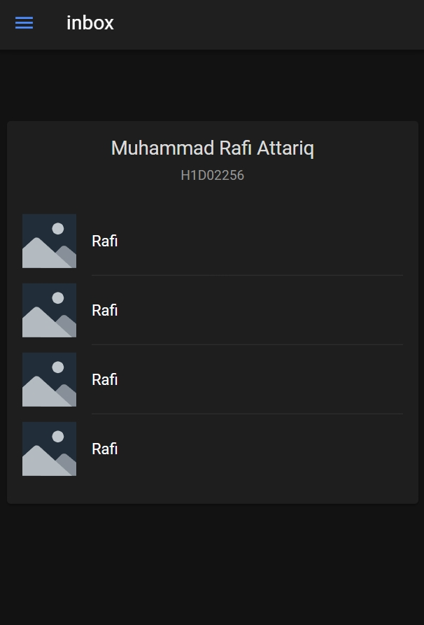

Nama: Muhammad Rafi Attariq

NIM: H1D022056

Shift Baru: D

# Tugas Pertemuan 7



Komponen yang ditambahkan adalah list beserta dengan item. Berikut adalah cara menambahkannya:

1. Kunjungi https://ionicframework.com/docs/api/list
2. Copy kode dari segment `Basic Usage` ke container di file `folder.page.html`
3. Kustomisasi hingga didapatkan kode yang diinginkan
```
<ion-card>
      <ion-card-header>
        <ion-card-title>Muhammad Rafi Attariq</ion-card-title>
        <ion-card-subtitle>H1D02256</ion-card-subtitle>
      </ion-card-header>
      <ion-card-content>
        <ion-list>
          <ion-item>
            <ion-thumbnail slot="start">
              
            </ion-thumbnail>
            <ion-label>Rafi</ion-label>
          </ion-item>
    
          <ion-item>
            <ion-thumbnail slot="start">
              
            </ion-thumbnail>
            <ion-label>Rafi</ion-label>
          </ion-item>
    
          <ion-item>
            <ion-thumbnail slot="start">
              
            </ion-thumbnail>
            <ion-label>Rafi</ion-label>
          </ion-item>
    
          <ion-item lines="none">
            <ion-thumbnail slot="start">
              
            </ion-thumbnail>
            <ion-label>Rafi</ion-label>
          </ion-item>
        </ion-list>
      </ion-card-content>
    </ion-card>
```
